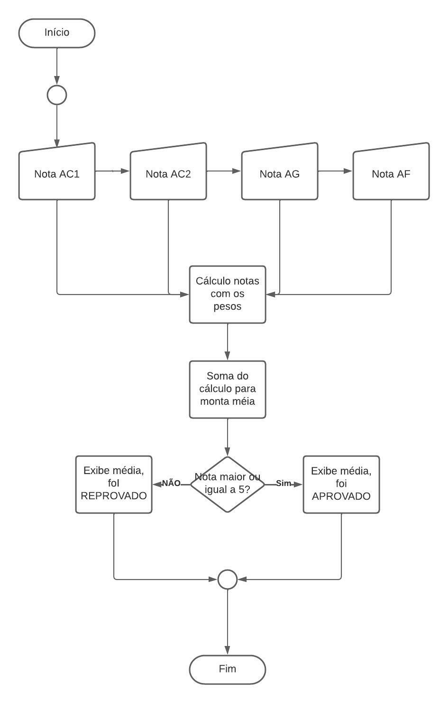

# Exercício 3 da AC2
Cálculo de média

## Algoritmo do Exercício
    INICIO
        Digite a nota AC1, FAÇA
        Digite a nota AC2, FAÇA
        Digite a nota AG, FAÇA
        Digite a nota AF, FAÇA
        Calculo média, FAÇA
        SE media maior ou igua a 5, FAÇA
            Está aprovado
        SE NÃO
            Está Reprovado
        FIM SE
    FIM

## Fluxograma

